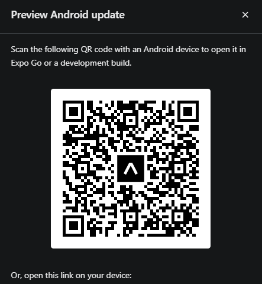

# Star Wars Favorites - React Native App

## Project Overview
This mobile application, developed using React Native, allows users to select their favorite characters from the Star Wars universe and specify their gender. It also displays the total count of favorite characters based on gender, including males, females, and characters of other genders from the entire Star Wars universe.

The app makes API requests to (https://swapi.dev/) to fetch character information. Users can browse a list of retrieved characters, access detailed character profiles, mark them as favorites, and calculate the total number of characters for each gender.

Additionally, users can sort characters alphabetically and search for specific characters on the page using keywords or initials. The advantage of local storage ensures that users don't need to worry about losing their favorite characters, as they will be preserved across sessions.


# How to open an app on Android




# How to open an app on IOS


## Installation

To run the app locally, you'll need Node.js, npm (or yarn), and Expo CLI installed on your machine.

1. Clone this repository.
2. Navigate to the project folder and run the following command:

   ```bash
   npm install
   # or
   yarn install
   Usage
   When you open the app, you'll see a list of Star Wars characters.
   Click on any character to view more details about them.
   Use the heart icon to add or remove characters from your favorites.
   The total number of male, female, and other favorite characters is displayed.
   Reset
   To reset your favorites and character counts, click the "Reset" button in the app.
   ```

Technologies
React Native
Expo
SWAPI
